# OceanBase 多模型搜索演示项目

[English Version](./README.md)

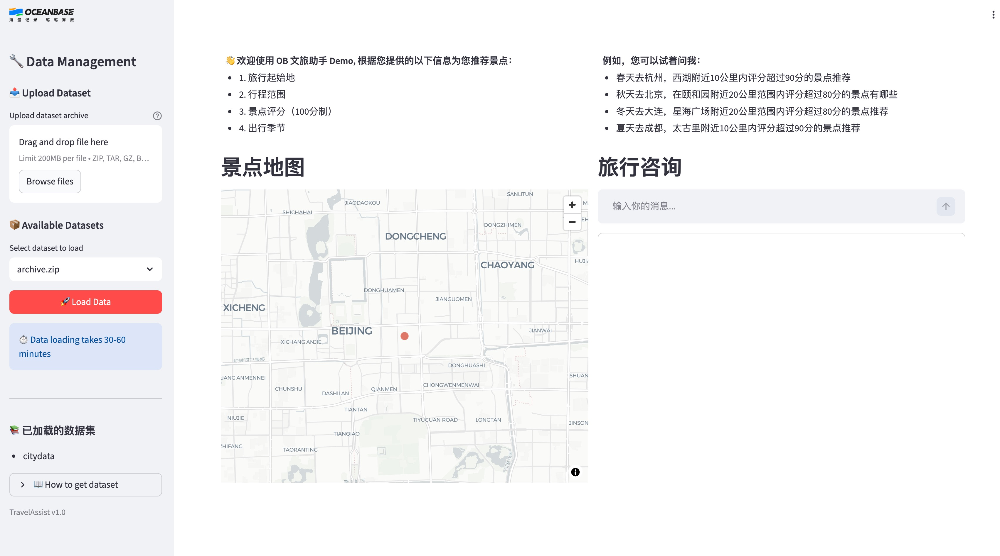

## 概念介绍

多模融合：多模融合是 OceanBase 一体化产品理念的一个重要方向。本文的多模融合主要指的是多模数据混合检索技术。OceanBase 支持向量数据、空间数据、文档数据、标量数据等类型融合查询，基于向量索引、空间索引、全文索引等多种索引的支持，提供更高性能的混合检索能力。
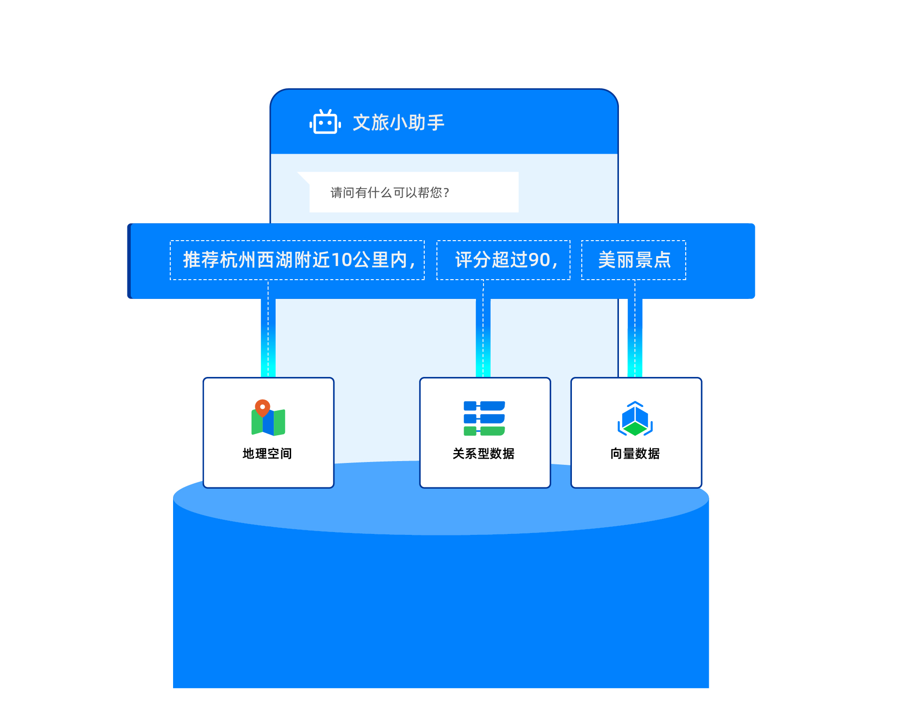

## 获取 LLM API 密钥

```
备注: 开通阿里云百炼大模型服务需要您跳转至第三方平台完成。此操作将遵循第三方平台的收费规则，并可能产生相应费用。请在继续前，访问其官网或查阅相关文档，确认并接受其收费标准。如不同意，请勿继续操作。
```

注册 [阿里云百炼账号](https://bailian.console.aliyun.com/)，开通模型服务并获取 API 密钥。
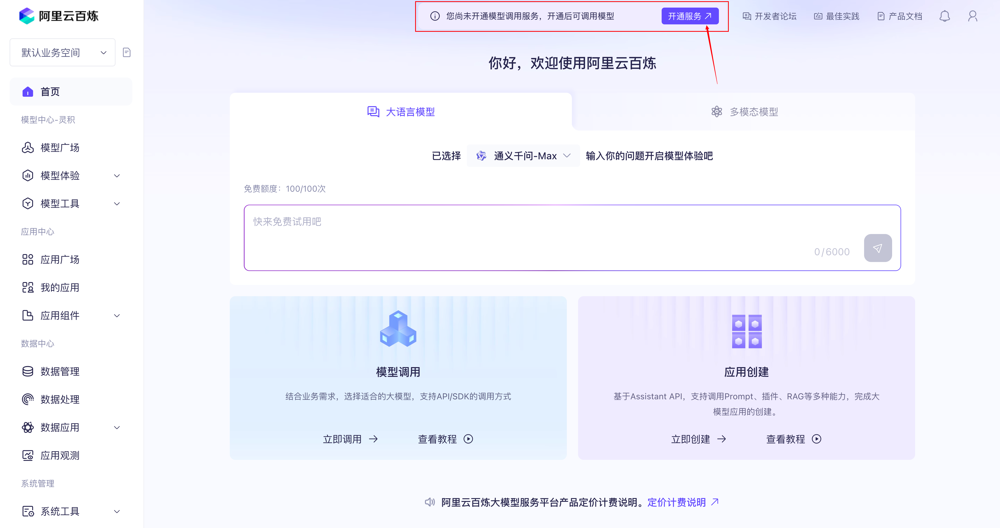
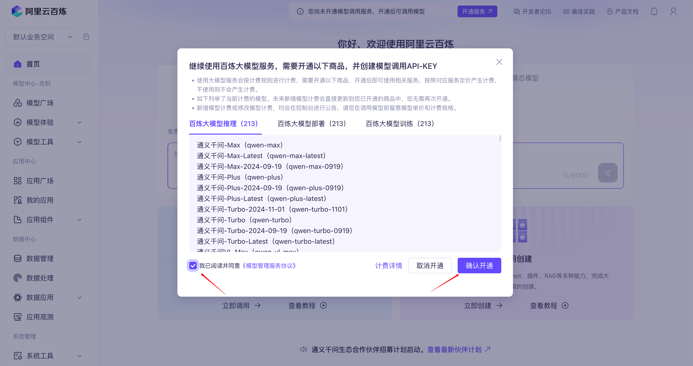
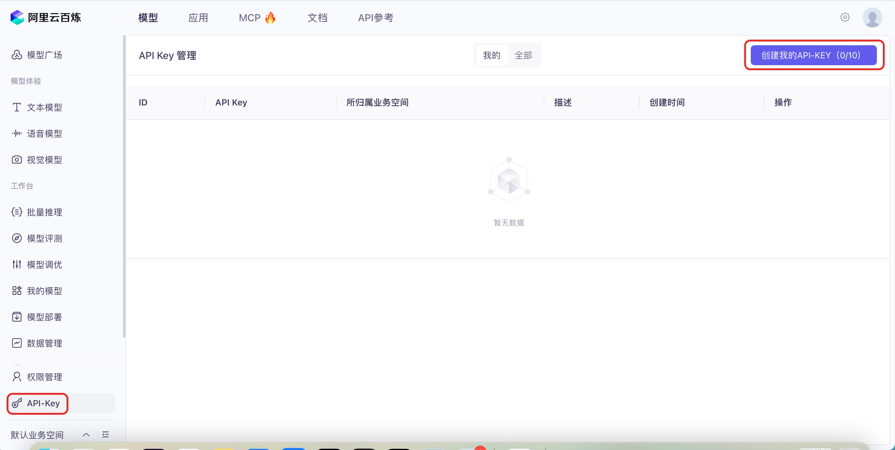
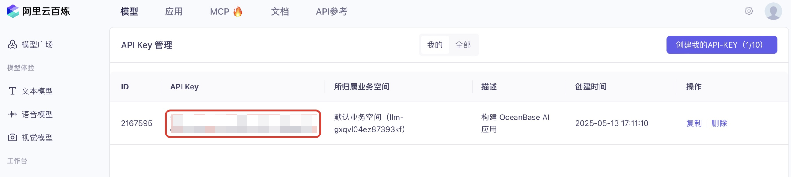

## 获取地理服务 API 密钥
```
备注: 开通高德地图地理服务需要您跳转至第三方平台完成。此操作将遵循第三方平台的收费规则，并可能产生相应费用。请在继续前，访问其官网或查阅相关文档，确认并接受其收费标准。如不同意，请勿继续操作。
```
注册高德开放平台，并获取[基础 LBS 服务](https://lbs.amap.com/upgrade#price) API 密钥。
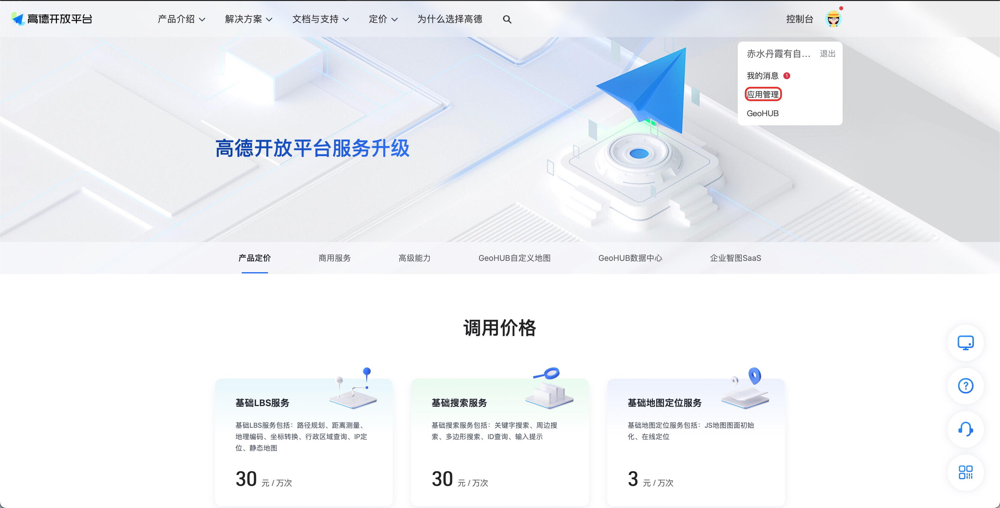
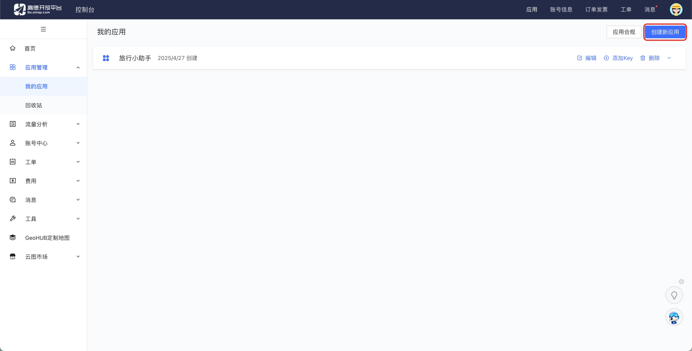
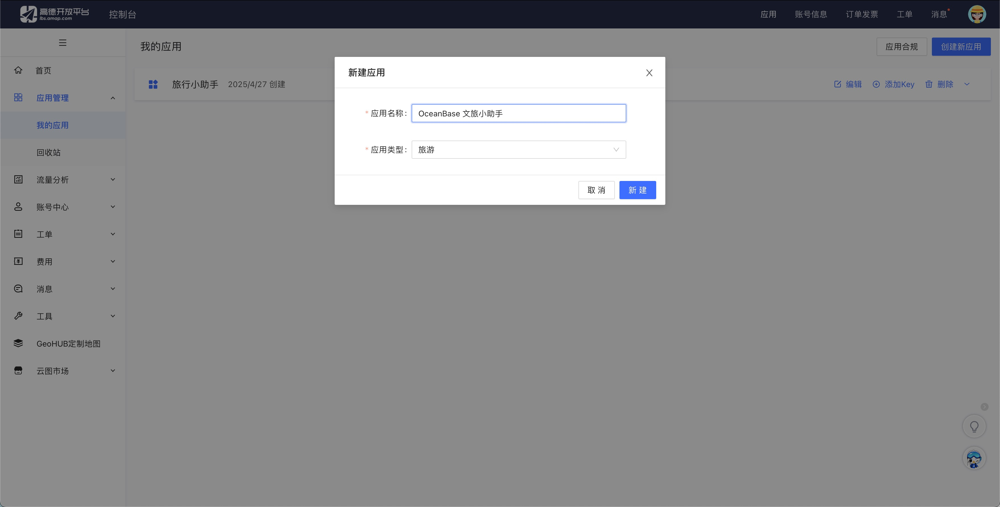
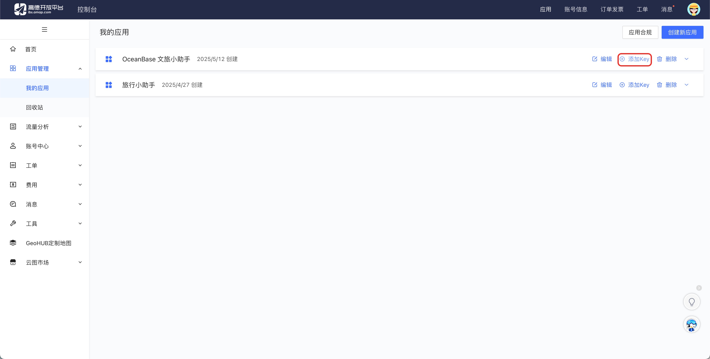
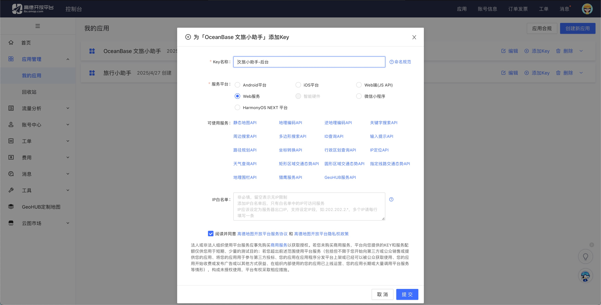
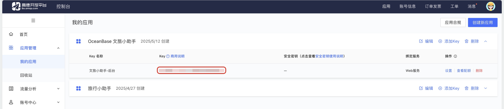

## 下载公开数据集
下载 [Kaggle 的中国城市景点详情数据集](https://www.kaggle.com/datasets/audreyhengruizhang/china-city-attraction-details) ZIP 压缩包。


## 创建 云上体验集群(可选)
 [免费的 OceanBase 云实例](https://www.oceanbase.com/free-trial), 申请体验集群
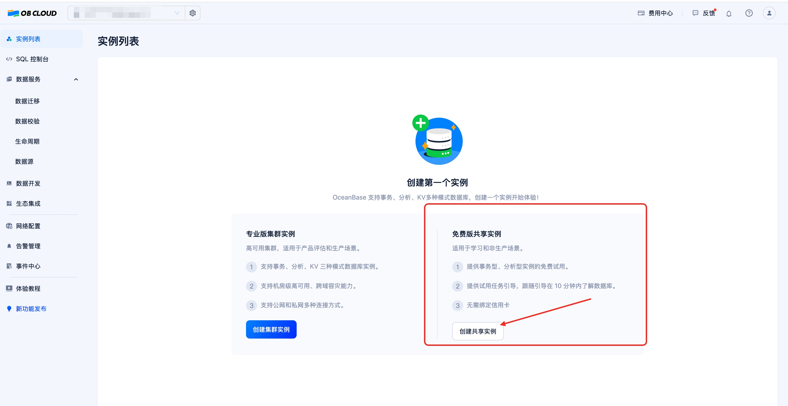


## 构建您的文旅小助手

### 配置 .env 文件

```bash
cd docker
cp .env.example .env
vim .env # 设置你的 DASHSCOPE_API_KEY 和 AMAP_API_KEY。
```

关键配置, 更多详情, 可直接阅读 .env 文件, 每个配置项的注释说明：
- 设置 `REUSE_CURRENT_DB=false` 以自动启动 Docker 数据库, 如果已经搭建了 OceanBase 集群, 此处可设置为true
- 设置 `DB_STORE=seekdb` 或 `DB_STORE=oceanbase` 选择数据库类型
- 设置 `DB_PASSWORD` 为实际的数据库密码
- 配置模型服务的 `DASHSCOPE_API_KEY`,  阿里云百炼平台 LLM API 密钥
- 配置地图服务的 `AMAP_API_KEY`,  高德开放平台, API key


### 快速开始 (Docker Compose 方式, 推荐使用)
```bash
cd docker
docker compose up -d
```


### 手动启动
```bash
make init
make start
```

### 加载 中国城市景点详情数据集

打开 http://localhost:8501, 将在之前下载的中国城市景点详情数据集, 上传并加载进入
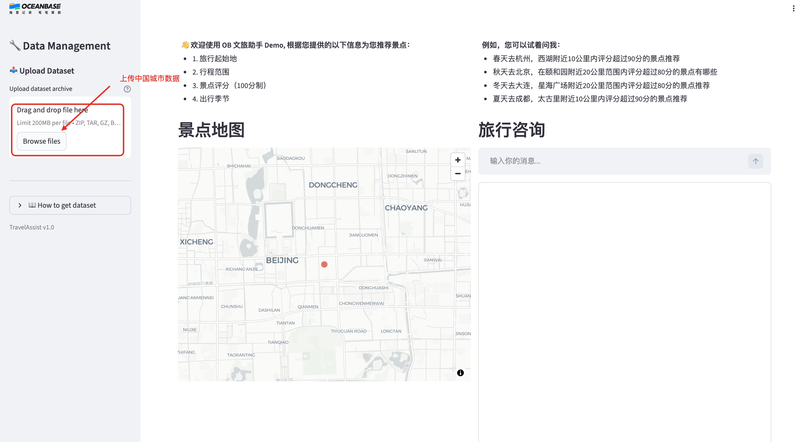
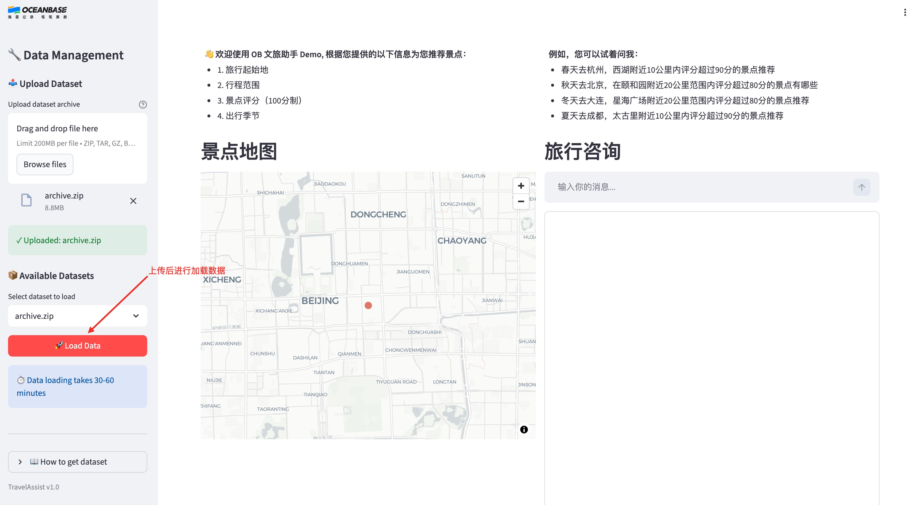


## 快速开始 (Docker Compose)

1. 在 `docker` 目录下创建 `.env` 文件并配置 API 密钥：
```bash
cd docker
cp .env.example .env
vim .env # 设置你的 DASHSCOPE_API_KEY 和 AMAP_API_KEY。
```
2. 启动服务：
```bash
docker compose up -d
```
3. 打开 http://localhost:8501 并按照侧边栏指引上传并加载数据集。

## 其他安装方式

### 选项 1: 一键 Docker 安装

1. (可选但推荐) 安装 [uv](https://github.com/astral-sh/uv) 以实现快速 Python 包管理：

```bash
curl -LsSf https://astral.sh/uv/install.sh | sh
```

2. 根据 `.env.example` 创建 `.env` 文件：

```bash
cp .env.example .env
```

3. 编辑 `.env` 文件以配置数据库和 API 密钥：

```bash
vim .env
```

关键配置：
- 设置 `REUSE_CURRENT_DB=false` 以自动启动 Docker 数据库
- 设置 `DB_STORE=seekdb` 或 `DB_STORE=oceanbase` 选择数据库类型
- 配置模型服务的 `DASHSCOPE_API_KEY`
- 配置地图服务的 `AMAP_API_KEY`

4. 运行初始化脚本以启动 Docker 数据库：

```bash
bash scripts/init_docker.sh
```

该脚本将：
- 自动下载并启动 SeekDB 或 OceanBase Docker 容器
- 等待数据库准备就绪
- 验证数据库连接

### 选项 2: 手动 Docker 安装

1. 使用 docker 部署单机版 OceanBase 服务器：

```bash
# 对于 SeekDB (轻量级)
docker run --name seekdb -e -d -p 2881:2881 -p 2886:2886 oceanbase/seekdb

# 或对于 OceanBase CE (全功能版)
docker run --name=oceanbase-ce -e OB_TENANT_PASSWORD=your-password -e datafile_size=10G -p 2881:2881 -d oceanbase/oceanbase-ce
```

你也可以使用 [免费的 OceanBase 云实例](https://www.oceanbase.com/free-trial)

2. 在本项目目录下创建 `.env` 文件并进行配置：

```bash
vim .env
```

```plain
# 数据库配置
REUSE_CURRENT_DB=true
DB_STORE=seekdb
DB_HOST="127.0.0.1"
DB_PORT="2881"
DB_USER="root"
DB_PASSWORD="your-password"
DB_NAME="test"
DB_SSL_CA_PATH=""
```

### 所有方式通用步骤

3. 获取 API 密钥并在 `.env` 中配置：
   - 访问 https://www.aliyun.com/product/bailian 获取模型服务的 `DASHSCOPE_API_KEY`
   - 访问 https://lbs.amap.com/ 获取地图服务的 `AMAP_API_KEY`

4. 获取数据集：
   - 访问 https://www.kaggle.com/datasets/audreyhengruizhang/china-city-attraction-details
   - 下载并将其存储在本项目目录下手动创建的 `citydata` 目录中

5. 安装 Python 依赖：

```bash
uv sync
```

6. 启动对话服务器：

```bash
streamlit run src/ui.py
```
